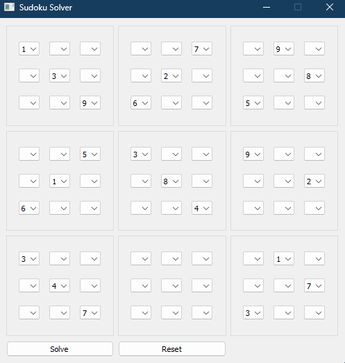

# Sudoku Solver with PyQt5

Python Sudoku solver that uses both the basic solving methods as well as a guess-and-check heuristic to solve more complex puzzles.
## Features
- Capable of solving any valid puzzle.
- Simple GUI for inputting Sudoku puzzles and viewing solutions.

## Demonstration

Demonstration of the solver solving the "AI Escargot" puzzle from [SudokuWiki](https://www.sudokuwiki.org/), which was created to be "the world's hardest Sudoku."

*Screenshot of the GUI with the unsolved Puzzle*



*Screenshot of the GUI after clicking the solve button*


## Setup

```bash
pip install -r requirements.txt
python cli.py